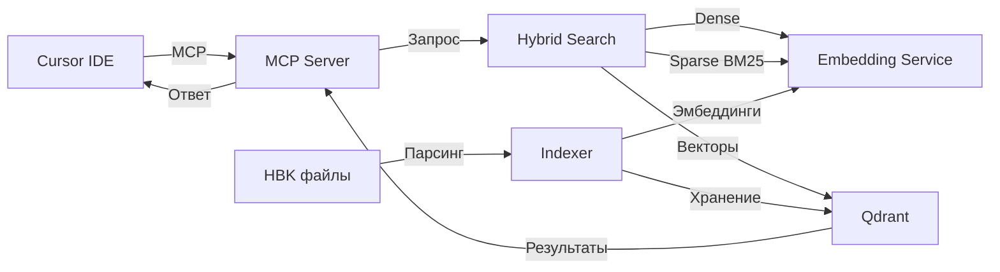

# Onec Platform Help MCP Server

[](https://github.com/rzateev/onec-help-mcp)
[](LICENSE)
[](https://www.docker.com/)
[](https://www.python.org/)
[](https://modelcontextprotocol.io/)

> **MCP сервер с RAG-поиском по официальной справке платформы 1C:Enterprise (через MCP и REST API)**

Предоставляет набор **MCP tools** и **REST API** для гибридного поиска (BM25 + семантика) по справке платформы 1С. Работает с любым MCP-клиентом (Cursor IDE, Claude Desktop) или через HTTP запросы.

**Что это даёт:** вместо переключения в браузер, AI-ассистент в вашей IDE получает контекст из справки 1С и отвечает на вопросы типа *"Как создать документ?"* или *"Покажи метод Запрос.Выполнить"* с точными данными из нужной версии платформы.

### 💡 Примеры использования

**Вариант 1: Точный поиск API элемента** (когда LLM знает что искать)
```
💬 Вы: "Покажи метод HTTPСоединение.ОтправитьДляОбработки"
🤖 AI: [использует search_1c_platform_api → get_1c_platform_element]

📋 HTTPСоединение.ОтправитьДляОбработки(HTTPЗапрос, ИмяВыходногоФайла)

   Отправляет HTTP-запрос серверу асинхронно для обработки в фоновом режиме.

   Параметры:
   • HTTPЗапрос (HTTPЗапрос) — объект с параметрами запроса [обязательный]
   • ИмяВыходногоФайла (Строка) — имя файла для сохранения ответа [необязательный]

   Возвращает: HTTPОтвет
```

**Вариант 2: Семантический поиск** (общий вопрос)
```
💬 Вы: "Как отправить асинхронный HTTP запрос?"
🤖 AI: [использует search_1c_help → search_1c_platform_api → get_1c_platform_element]

📋 Найдено: HTTPСоединение.ОтправитьДляОбработки

   Для асинхронной отправки HTTP-запроса используйте метод ОтправитьДляОбработки()
   объекта HTTPСоединение. Позволяет не блокировать выполнение кода...
```

**Дополнительный пример: семантика по HTTP-группе методов**
```
💬 Вы: "Как отправить данные для обработки HTTP запросом в 1С?"
🤖 AI: [использует search_1c_help]

📋 Найдено по смыслу:
   • HTTPСоединение.ПолучитьЗаголовкиАсинх — HEAD-запрос (асинхронно)
   • HTTPЗапрос — тип описания HTTP-запроса
   • HTTPСоединение.ПолучитьАсинх — GET-запрос (асинхронно)
   • HTTPСоединение.Получить — GET-запрос
   • HTTPСоединение.ЗаписатьАсинх — PUT-запрос (асинхронно)

💬 Вы: "Покажи сигнатуру HTTPСоединение.ОтправитьДляОбработки"
🤖 AI: [использует search_1c_platform_api → get_1c_platform_element]
📋 HTTPСоединение.ОтправитьДляОбработки(HTTPЗапрос, ИмяВыходногоФайла)
```

**Через REST API:**
```bash
# Точный поиск
curl -X POST http://localhost:9063/api/platform/element \
  -H "Content-Type: application/json" \
  -d '{"element_name": "ОтправитьДляОбработки", "parent_type": "HTTPСоединение"}'

# Семантический поиск
curl -X POST http://localhost:9063/api/search \
  -H "Content-Type: application/json" \
  -d '{"query": "как отправить асинхронный HTTP запрос", "limit": 5}'
```

---

## ✨ Возможности

- 🔍 **Гибридный поиск** — точные совпадения (BM25) + семантический поиск понимают ваш вопрос на русском/английском
- 📚 **Поддержка версий** — работа с несколькими версиями платформы одновременно (8.3.24, 8.3.26...)
- 🎯 **Структурированный API** — поиск функций, методов, свойств, типов с сигнатурами и примерами
- 🌐 **Два способа доступа** — MCP protocol для IDE или REST API для scripts/skills
- ⚡ **Встроенные сервисы** — Qdrant и embedding-сервис из коробки, не требует внешних зависимостей
- 🐳 **Docker-ready** — один `docker compose up` для запуска всего стека
- 🎮 **Режимы CPU/GPU** — быстрая индексация на GPU или экономичная на CPU

---

## 🚀 Быстрый старт

### Требования

- Docker и Docker Compose
- Cursor IDE (или другой MCP клиент)
- Файлы справки 1С (`shcntx_ru.hbk` и `shcntx_root.hbk` из установки платформы)

### Установка за 3 шага

**0. Клонируйте репозиторий**

```bash
git clone https://github.com/rzateev/onec-help-mcp.git
cd onec-help-mcp
```

**1. Подготовьте файлы справки**

Скопируйте файлы из установки 1С в каталог проекта:

```bash
# Windows: обычно C:\Program Files\1cv8\8.3.26.XXXX\bin\
# Linux: /opt/1cv8/x86_64/8.3.26.XXXX/bin/

mkdir -p data/help1c/8.3.26
# Скопируйте shcntx_ru.hbk и shcntx_root.hbk в data/help1c/8.3.26/
```

<details>
<summary>Где найти файлы справки?</summary>

**Путь к платформе:**
- Windows: `C:\Program Files\1cv8\<версия>\bin\`
- Linux: `/opt/1cv8/<версия>/bin/`

**Нужные файлы:**
- `shcntx_ru.hbk` — справка на русском языке (обязательно)
- `shcntx_root.hbk` — корневая справка (обязательно)

Имя каталога (`8.3.26`, `8.3.24`) должно соответствовать версии платформы.
</details>

**2. Запустите сервер**

```bash
docker compose up -d
```

Проверьте статус:
```bash
curl http://localhost:9063/health
# {"status":"healthy", "service":"MCP 1C Help Server", ...}
```

<details>
<summary>Запуск в GPU-режиме (опционально)</summary>

Если есть NVIDIA GPU и Docker с NVIDIA Runtime:
```bash
docker compose -f docker-compose.yml -f docker-compose.gpu.yml up -d
```

Подробнее: [DEPLOYMENT.md](docs/DEPLOYMENT.md)
</details>

**3. Настройте Cursor IDE**

Добавьте в `~/.cursor/mcp.json` (Windows: `C:\Users\<имя>\.cursor\mcp.json`):

```json
{
  "mcpServers": {
    "onec-platform-help": {
      "url": "http://localhost:9063/mcp",
      "timeout": 60
    }
  }
}
```

Перезапустите Cursor или перезагрузите окно (`Ctrl+Shift+P` → Reload Window).

### Первое использование

**Индексация (один раз для каждой версии):**

В чате Cursor напишите:
```
Вызови тул manage_platform_help с action="index" и version="8.3.26"
```

Индексация займёт 5-15 минут (CPU) или 2-5 минут (GPU).

**Готово! Теперь спрашивайте:**

```
"Как создать HTTP-запрос?"
"Покажи метод Запрос.Выполнить"
"Найди функцию СтрДлина"
"Что такое СправочникОбъект?"
```

AI автоматически использует инструменты поиска по справке.

---

## 🛠️ Доступные MCP инструменты

| Инструмент | Описание |
|------------|----------|
| **search_1c_help** | Поиск по всей справке (естественные запросы) |
| **search_1c_platform_api** | Поиск API элементов (функции, методы, свойства, типы) |
| **get_1c_platform_element** | Полная карточка элемента с сигнатурой и примерами |
| **get_1c_platform_type_members** | Список методов/свойств типа (напр., HTTPЗапрос, Массив) |
| **manage_platform_help** | Управление версиями: индексация, список версий, настройки |

> 📖 Подробное описание всех инструментов: [TOOLS.md](docs/TOOLS.md)

### 🌐 REST API (альтернатива MCP)

Все MCP инструменты доступны через HTTP REST API для использования без MCP сессии:

```bash
# Поиск в справке
curl -X POST http://localhost:9063/api/search \
  -H "Content-Type: application/json" \
  -d '{"query": "HTTPЗапрос", "limit": 5}'

# Поиск API элементов
curl -X POST http://localhost:9063/api/platform/search \
  -H "Content-Type: application/json" \
  -d '{"query": "HTTPСоединение", "element_type": "type"}'
```

**Применение:**
- ✅ Claude Code skills без MCP
- ✅ Интеграция с другими сервисами
- ✅ Тестирование и отладка
- ✅ Скрипты автоматизации

> 📖 Полная документация REST API: [REST_API.md](docs/REST_API.md)

---

## 📚 Документация

- **[TOOLS.md](docs/TOOLS.md)** — детальное описание MCP инструментов, параметров, примеров
- **[REST_API.md](docs/REST_API.md)** — HTTP REST API для доступа без MCP сессии
- **[DEPLOYMENT.md](docs/DEPLOYMENT.md)** — развёртывание (CPU/GPU режимы), настройка, переменные окружения
- **[ARCHITECTURE.md](docs/ARCHITECTURE.md)** — архитектура проекта, гибридный поиск, парсинг HBK
- **[TROUBLESHOOTING.md](docs/TROUBLESHOOTING.md)** — решение проблем, FAQ

---

## 🔧 Часто встречающиеся вопросы

<details>
<summary><b>Поиск ничего не находит</b></summary>

**Проверьте индексацию:**
```
💬 "Покажи список проиндексированных версий"
```

Если версии нет, выполните индексацию:
```
💬 "Вызови manage_platform_help с action='index' и version='8.3.26'"
```
</details>

<details>
<summary><b>Ошибка "expected dim: 768, got 384"</b></summary>

Коллекция создана под другую модель. Переиндексируйте:
```bash
docker compose down
rm -rf data/qdrant-storage
docker compose up -d
# Затем выполните индексацию в Cursor
```
</details>

<details>
<summary><b>Сервис не запускается</b></summary>

Проверьте логи:
```bash
docker compose logs onec-help-mcp
docker compose ps  # все контейнеры должны быть "Up"
```

Проверьте здоровье сервисов:
```bash
curl http://localhost:9063/health
curl http://localhost:8014/health
```
</details>

**Больше решений:** [TROUBLESHOOTING.md](docs/TROUBLESHOOTING.md)

---

## 🏗️ Как это работает



**Гибридный поиск:**
- **BM25** (sparse) — точные совпадения ключевых слов ("Запрос.Выполнить")
- **Semantic** (dense) — понимание смысла ("как выполнить SQL запрос")
- **RRF Fusion** — объединение лучших результатов из обоих методов

**Версионирование:**
Каждая версия — отдельная коллекция Qdrant (`1c_help_8_3_26`). Независимые индексы, параллельная работа.

> 🔍 Подробнее: [ARCHITECTURE.md](docs/ARCHITECTURE.md)

---

## 🐳 Docker конфигурация

```yaml
services:
  onec-help-mcp:        # MCP сервер (порт 9063)
  onec-help-embedding:  # Embedding сервис (порт 8014)
  onec-help-qdrant:     # Vector DB (порт 6347)
```

**Полезные команды:**
```bash
docker compose up -d              # Запуск
docker compose down               # Остановка
docker compose logs -f            # Логи
docker compose restart            # Перезапуск
curl localhost:9063/health        # Health check
```


---

## 📄 Лицензия

**MIT License — с указанием авторства Roman Zateev**

Copyright (c) 2025-2026 Roman Zateev

См. файл [LICENSE](LICENSE) для полного текста лицензии.

---

## 📞 Поддержка

**Возникли проблемы?**

1. Проверьте [TROUBLESHOOTING.md](docs/TROUBLESHOOTING.md)
2. Посмотрите логи: `docker compose logs onec-help-mcp`
3. Создайте Issue в GitHub

**Контакты:**
- GitHub Issues: [создать issue](https://github.com/rzateev/onec-help-mcp/issues/new)
- GitHub Discussions: [обсуждения](https://github.com/rzateev/onec-help-mcp/discussions)

---

<div align="center">

**Сделано с ❤️ для сообщества 1С**

Если проект полезен, поставьте ⭐ на [GitHub](https://github.com/rzateev/onec-help-mcp)!

[⭐ Star](https://github.com/rzateev/onec-help-mcp) • [🐛 Report Bug](https://github.com/rzateev/onec-help-mcp/issues/new) • [💡 Request Feature](https://github.com/rzateev/onec-help-mcp/discussions)

</div>
