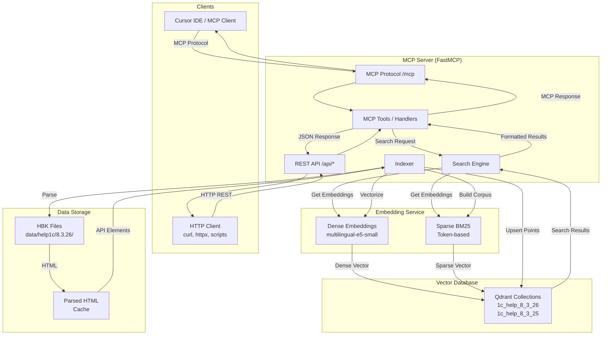
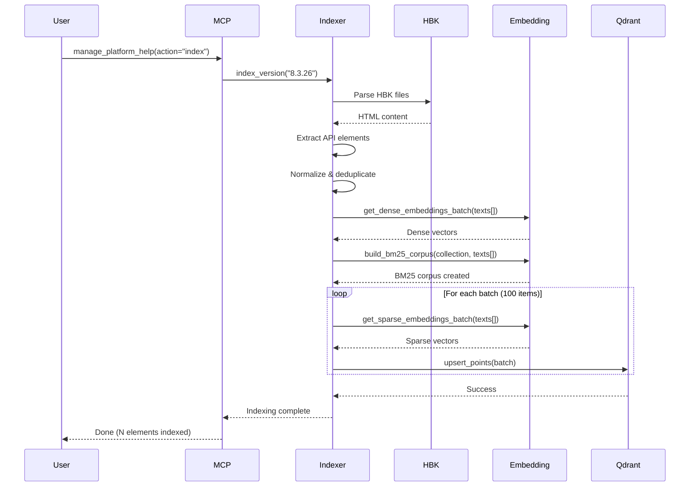

# Architecture — Архитектура проекта

Техническая документация по архитектуре MCP 1C Help Server.

---

## 🏗️ Общая архитектура



---

## 🔍 Гибридный поиск

### Принцип работы

Система комбинирует **два типа векторов** для максимальной точности:

1. **Dense векторы (семантика):**
   - Модель: `intfloat/multilingual-e5-small` (384 dimensions)
   - Понимает смысл запроса
   - Находит синонимы и концептуально похожие элементы
   - Пример: "создать объект" → "новый объект", "инициализация"

2. **Sparse векторы (BM25):**
   - Token-based инвертированный индекс
   - Точные совпадения ключевых слов
   - Учитывает частоту терминов (TF-IDF)
   - Пример: "Запрос.Выполнить" → точное совпадение имени метода

### Fusion алгоритм (RRF)

**Reciprocal Rank Fusion** — встроенный механизм Qdrant для объединения результатов:

```python
# Псевдокод
dense_results = search_dense(query_vector, limit=20)
sparse_results = search_sparse(query_vector, limit=20)

# RRF formula
for doc in all_docs:
    rrf_score = 0
    if doc in dense_results:
        rrf_score += 1 / (k + rank_dense(doc))
    if doc in sparse_results:
        rrf_score += 1 / (k + rank_sparse(doc))

# k = 60 (настраиваемый параметр RRF_K)
# Документы сортируются по rrf_score
```

**Настройки:**
- `SPARSE_BOOST=0.5` — вес sparse компонента (0.0-1.0)
- `RRF_K=60` — константа для сглаживания ранжирования
- `USE_HYBRID_SEARCH=true` — включить/выключить гибридный поиск

---

## 📦 Версионирование

### Изоляция версий

Каждая версия платформы хранится в **отдельной коллекции Qdrant**:

```
1c_help_8_3_24  ← Версия 8.3.24
1c_help_8_3_25  ← Версия 8.3.25
1c_help_8_3_26  ← Версия 8.3.26
```

**Преимущества:**

- ✅ **Независимые BM25 корпусы** — IDF (Inverse Document Frequency) рассчитывается отдельно для каждой версии
- ✅ **Изоляция данных** — изменения в одной версии не влияют на другие
- ✅ **Параллельная индексация** — можно индексировать несколько версий одновременно
- ✅ **Точность поиска** — BM25 учитывает частоту терминов именно для этой версии

### Резолюция версии

Порядок определения версии для поиска:

```mermaid
graph TD
    A[Tool Parameter<br/>platform_version] -->|Если указан| Z[Use This Version]
    A -->|Не указан| B[HTTP Header<br/>x-platform-version]
    B -->|Если есть| Z
    B -->|Нет| C[Default Version<br/>manage_platform_help]
    C -->|Если установлена| Z
    C -->|Не установлена| D[ENV DEFAULT_PLATFORM_VERSION]
    D -->|Если есть| Z
    D -->|Нет| E[Latest Available<br/>max(versions in data/help1c/)]
    E --> Z
```

**Пример:**
```python
# Приоритет 1: параметр тула
search_1c_help(query="...", platform_version="8.3.26")

# Приоритет 2: HTTP заголовок
Headers: {"x-platform-version": "8.3.25"}

# Приоритет 3: настроенная версия по умолчанию
manage_platform_help(action="default_set", version="8.3.24")

# Приоритет 4: переменная окружения
DEFAULT_PLATFORM_VERSION=8.3.26

# Приоритет 5: последняя доступная
ls data/help1c/ → ["8.3.24", "8.3.25", "8.3.26"]
# Выберется 8.3.26
```

---

## 📄 Парсинг HBK формата

### Структура HBK файла

`.hbk` — проприетарный формат справки 1С:Enterprise:

```
┌─────────────────────────────────────┐
│ Header (4096 bytes)                 │
│ - Signature                         │
│ - Version                           │
│ - File count                        │
│ - Index offset                      │
└─────────────────────────────────────┘
┌─────────────────────────────────────┐
│ File Index                          │
│ [filename, offset, size, ...]       │
└─────────────────────────────────────┘
┌─────────────────────────────────────┐
│ Compressed HTML Files (zlib)        │
│ file1.html (compressed)             │
│ file2.html (compressed)             │
│ ...                                 │
└─────────────────────────────────────┘
```

### Процесс парсинга


**Шаги:**

1. **HbkHelpReader** ([hbk_reader.py](src/parsers/hbk_reader.py)):
   - Читает header (4096 байт)
   - Парсит индекс файлов
   - Извлекает и распаковывает HTML (zlib)

2. **HtmlParser** ([html_parser.py](src/parsers/html_parser.py)):
   - BeautifulSoup парсинг HTML
   - Извлекает структурированные данные:
     - Функции (global functions)
     - Методы (object methods)
     - Свойства (properties)
     - Типы (types)
     - Конструкторы (constructors)
   - Извлекает метаданные:
     - Параметры и типы
     - Возвращаемые значения
     - Доступность (клиент/сервер/и т.д.)
     - Примеры кода

3. **ApiElementNormalizer** ([api_element.py](src/core/api_element.py)):
   - Дедупликация по ключу: `(element_type, name, parent_type)`
   - Приоритеты источников (методы > свойства > типы)
   - Объединение информации из разных файлов

### Приоритеты источников

```python
def _get_source_priority(html_path: str) -> int:
    """Больше = более релевантный источник"""
    if '/methods/' in path:      return 10  # Страницы методов
    if '/properties/' in path:   return 9   # Страницы свойств
    if '/constructors/' in path: return 8   # Страницы конструкторов
    if '/object' in path:        return 5   # Страницы объектов
    if '/functions/' in path:    return 3   # Страницы функций
    if '/events/' in path:       return 2   # Страницы событий
    return 1                                # Другие
```

**Логика дедупликации:**

```python
# Пример: метод "Выполнить" объекта "Запрос"
# может встречаться в:
# - /methods/query_execute.html (priority=10) ← выберем этот
# - /types/query_object.html (priority=5)
# - /overview/database.html (priority=1)

# ApiElementNormalizer оставит элемент с максимальным priority
```

---

## 🗄️ Qdrant Schema

### Структура коллекции

```python
# Конфигурация коллекции
collection_config = {
    "vectors": {
        "content": {
            "size": 384,  # multilingual-e5-small
            "distance": "Cosine"
        }
    },
    "sparse_vectors": {
        "sparse_bm25": {
            "index": {
                "on_disk": False
            }
        }
    }
}
```

### Структура Point

```python
point = {
    "id": "uuid-v4",
    "vector": {
        "content": [0.123, -0.456, ...],  # 384 dimensions
        "sparse_bm25": SparseVector(
            indices=[45, 127, 892, ...],
            values=[0.89, 0.67, 0.45, ...]
        )
    },
    "payload": {
        # Основные поля
        "element_type": "method",
        "name": "Выполнить",
        "parent_type": "Запрос",
        "element_id": "method_Запрос_Выполнить",

        # Контент для поиска
        "title": "Запрос.Выполнить",
        "description": "Выполняет запрос к базе данных...",
        "content": "Полное описание + параметры + примеры",

        # Метаданные
        "signature": "Выполнить() Возвращаемое значение: РезультатЗапроса",
        "parameters": [...],
        "return_type": "РезультатЗапроса",
        "availability": ["Клиент", "Сервер"],
        "examples": ["код примера..."],

        # Служебная информация
        "source_file": "method_query_execute.html",
        "platform_version": "8.3.26",
        "indexed_at": "2025-02-12T10:30:00Z"
    }
}
```

### Индексирование payload

Qdrant автоматически создаёт индексы для фильтрации:

```python
# Фильтры при поиске
filter = {
    "must": [
        {"key": "element_type", "match": {"value": "method"}},
        {"key": "platform_version", "match": {"value": "8.3.26"}}
    ]
}
```

---

## 🚀 Процесс индексации

### Workflow



### Этапы индексации

1. **Parsing** (5-20% времени):
   - Чтение HBK файлов
   - Извлечение HTML
   - Парсинг структуры
   - Нормализация элементов

2. **Building BM25 Corpus** (10-30% времени):
   - Отправка всех текстов в embedding-service
   - Построение инвертированного индекса
   - Расчёт IDF для всего корпуса

3. **Vectorization** (40-60% времени):
   - Dense embeddings: 384-мерные векторы (семантика)
   - Sparse embeddings: BM25 токены (точные совпадения)
   - Батчинг по 100 элементов (настраивается `MAX_BATCH_SIZE`)

4. **Uploading to Qdrant** (10-20% времени):
   - Upsert points батчами
   - Построение HNSW индекса для dense векторов
   - Построение inverted index для sparse векторов

**Примерное время:**
- CPU (4 cores): 10-20 минут (~10,000 элементов)
- GPU (CUDA): 2-5 минут

---

## 🔌 Embedding Service

### Архитектура

Встроенный FastAPI сервис ([embedding_service_lite/](embedding_service_lite/)):

```python
# Endpoints
POST /embed               # Dense embeddings (batch)
POST /embed/sparse        # Sparse BM25 embeddings (batch)
POST /bm25/build-corpus   # Build BM25 corpus for collection
GET  /health              # Health check
```

### Dense Embeddings

**Модель:** `intfloat/multilingual-e5-small`
- Size: 384 dimensions
- Multilingual: русский + английский
- Fast: ~30ms на текст (CPU), ~5ms (GPU)

**Нормализация:**
```python
# Prefix для query vs document
query_text = f"query: {user_query}"
doc_text = f"passage: {api_element_content}"

# L2 normalization (для Cosine similarity)
vector = normalize(model.encode(text))
```

### Sparse BM25

**Token-based индекс:**

```python
# Tokenization
tokens = tokenizer.encode(text)  # [45, 127, 892, ...]

# BM25 weights
for token_id in unique_tokens:
    tf = count(token_id) / len(tokens)
    idf = log(N / df[token_id])  # N = corpus size
    weight = (k1 + 1) * tf / (k1 * (1 - b + b * doc_len/avg_doc_len) + tf) * idf

# Sparse vector
sparse_vector = {
    "indices": [45, 127, 892],
    "values": [0.89, 0.67, 0.45]
}
```

**Параметры BM25:**
- `k1 = 1.5` — term frequency saturation
- `b = 0.75` — document length normalization

### Батчинг

```python
# Лимиты (настраиваются в .env)
MAX_BATCH_SIZE = 100        # Dense/Sparse embeddings
MAX_CORPUS_SIZE = 50000     # BM25 corpus build

# Таймауты
EMBEDDING_REQUEST_TIMEOUT = 10    # Обычные запросы
EMBEDDING_BATCH_TIMEOUT = 120     # Батч-запросы
```

---

## 🛠️ MCP Tools Implementation

### Регистрация инструментов

```python
# src/server.py
from fastmcp import FastMCP

mcp = FastMCP(name="MCP 1C Help Server")

# Tool registration через декоратор
@mcp.tool()
async def search_1c_help(
    query: str,
    platform_version: str | None = None,
    limit: int = 5
) -> str:
    """Docstring становится описанием тула в MCP"""
    # Реализация...
    return formatted_markdown_string
```

### Async I/O паттерны

**Все file I/O в thread:**

```python
import asyncio

# Blocking file operations → thread
available_versions = await asyncio.to_thread(
    get_available_versions  # Reads data/help1c/ directory
)

# HTTP requests → async (httpx)
results = await embedding_service.get_dense_embedding(query)
collections = await qdrant_service.get_collections_async()
```

### Error Handling

```python
# Graceful degradation
try:
    # Try hybrid search
    results = await hybrid_search(query)
except Exception:
    # Fallback to dense-only
    logger.warning("Sparse search failed, using dense-only")
    results = await dense_search(query)
```

---

## 📊 Performance

### Оптимизации

1. **Батчинг:**
   - Dense embeddings: 100 texts/batch
   - Sparse embeddings: 100 texts/batch
   - Qdrant upsert: 100 points/batch

2. **Кэширование:**
   - BM25 corpus кэшируется в embedding-service
   - Qdrant HNSW index в памяти

3. **Параллелизация:**
   - Независимые версии → независимые коллекции
   - Можно индексировать параллельно (разные процессы)

### Метрики

**Индексация (~10,000 элементов):**
- CPU (4 cores): 10-20 минут
- GPU (CUDA): 2-5 минут

**Поиск:**
- Dense-only: 50-100ms
- Hybrid (BM25 + Dense): 100-200ms
- С форматированием результата: +50ms

---

## 🔗 См. также

- [README.md](../README.md) — быстрый старт
- [TOOLS.md](TOOLS.md) — справочник MCP инструментов
- [DEPLOYMENT.md](DEPLOYMENT.md) — развёртывание и настройка
- [TROUBLESHOOTING.md](TROUBLESHOOTING.md) — решение проблем
